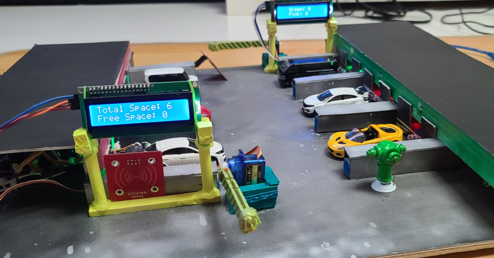

With the rapid development of smart cities, it is no doubt that the IoT concept will be seen more and more in our daily life. By observing the trend, a smart car park will be built in order to improve the environment and design of car parks.
In this project, research both firsthand and secondhand have been carried out to find out the problems and the possible solutions to solve the problem that has been observed. Afterward, a smart car park system will be built with an 
(1)auto barrier system,  
(2)parking guidance system  
(3)monitors showing available spaces  
(4)air circulation system  
(5)LED lighting  
(6)a warning system built in narrow roads.  
