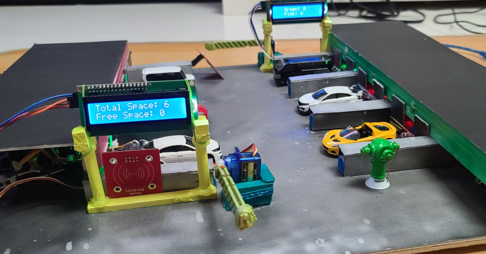

  
The objective of this project is to build a smart car park with following features:  
(1)auto barrier system,  
(2)parking guidance system  
(3)monitors showing available spaces  
(4)air circulation system  
(5)LED lighting  
(6)a warning system built in narrow roads.  
